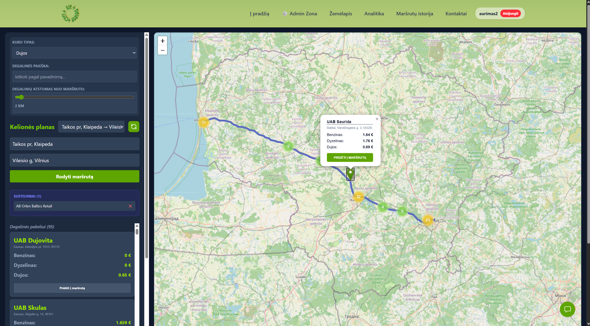
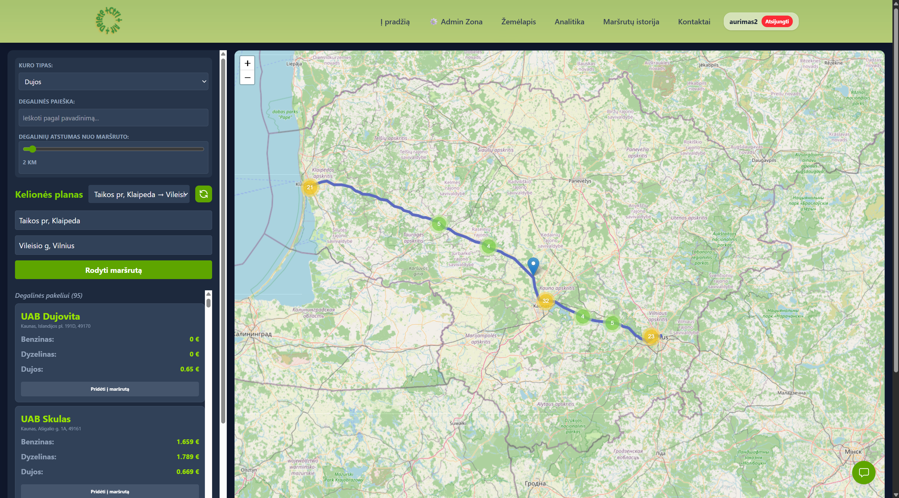
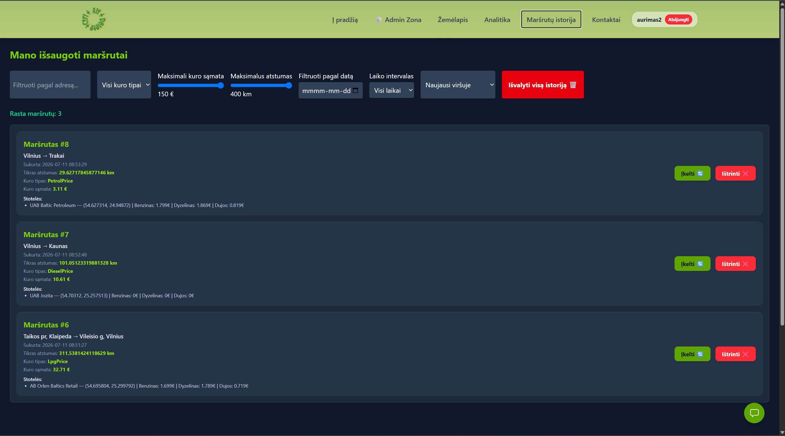
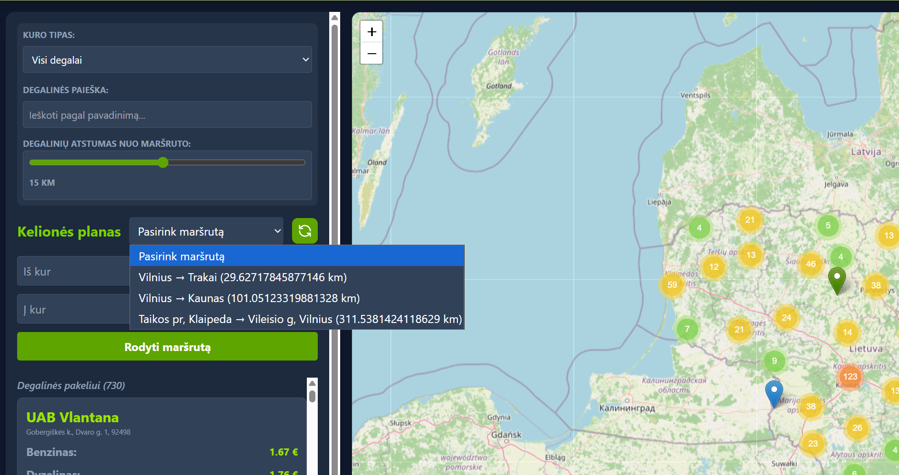
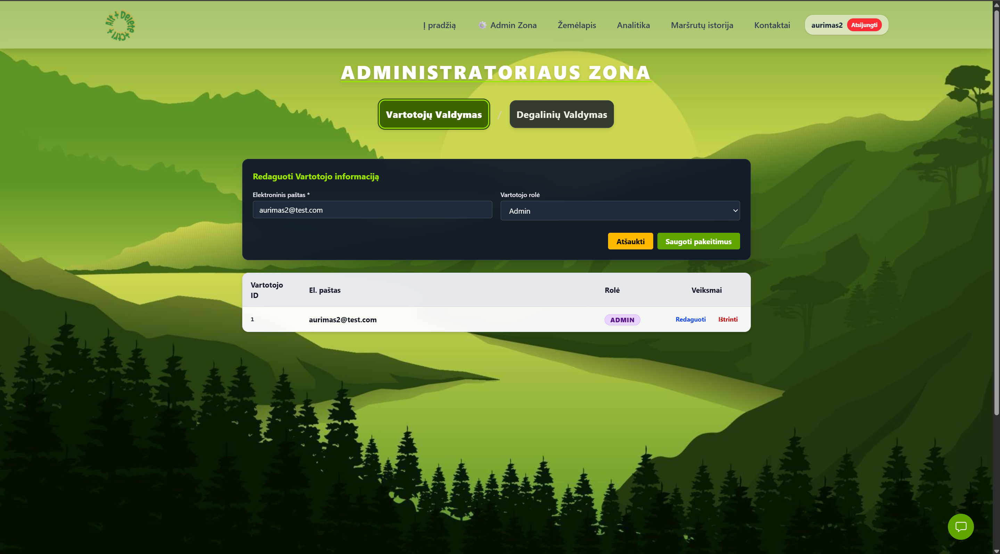
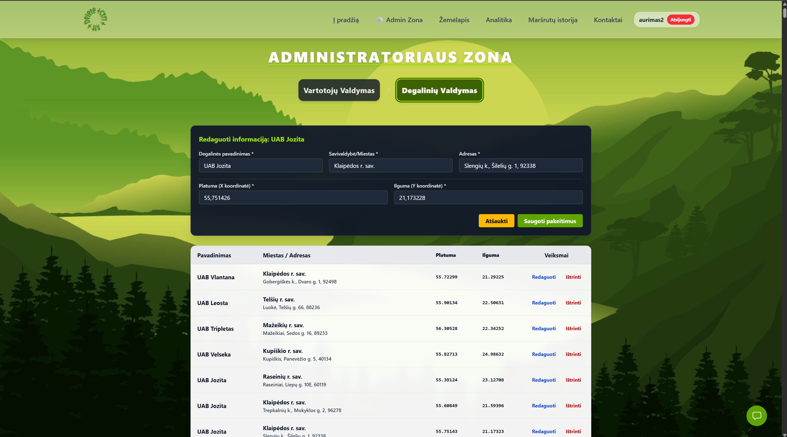

# KuroOpti

[](https://github.com/AurimasG1/KuroOpti/actions/workflows/ci.yml)

KuroOpti is a full-stack route-planning application that helps users calculate routes, find nearby fuel stations, compare fuel prices, add fuel stops and save routes.

The project was originally created as a team graduation project. The `v2-aurimas` branch contains independent stabilization work, testing, CI, Docker support, frontend cleanup and a redesigned ENA fuel-price importer.



## Main features

- User registration and JWT authentication
- Persistent login state and protected routes
- Role-based administrator access
- Route calculation between two addresses
- Fuel stations displayed near the route
- Configurable station distance from the route
- Filtering by fuel type, station name, address and municipality
- Adding and removing fuel-station waypoints
- Opening the final route in Google Maps
- Saving and restoring route history
- Importing fuel prices from ENA Excel data
- Geocoding new stations with Google Geocoding API
- Swagger / OpenAPI documentation

## Technology stack

### Backend

- .NET 8
- ASP.NET Core Web API
- Entity Framework Core 8
- Pomelo Entity Framework Core provider for MySQL
- MySQL 8
- JWT authentication
- Swagger / OpenAPI
- `HttpClient`
- `HtmlAgilityPack`
- `ClosedXML`
- Google Geocoding API
- xUnit
- Moq

### Frontend

- React 18
- Vite 5
- React Router
- Tailwind CSS
- Leaflet
- React Leaflet
- Leaflet Routing Machine
- Turf.js
- native Fetch API
- ESLint

### Infrastructure

- Docker
- Docker Compose
- Nginx
- phpMyAdmin
- GitHub Actions

## ENA fuel-price importer

The importer uses:

- `HtmlAgilityPack` to read the ENA webpage and locate the current SharePoint Excel link;
- `HttpClient` to download and validate the XLSX file;
- `ClosedXML` to read worksheets, columns, dates and prices;
- grouping logic to combine separate fuel rows into one fuel-station record;
- Entity Framework Core to update MySQL;
- Google Geocoding API only for stations without stored coordinates.

It supports both long and wide Excel layouts and rejects stale source data before modifying the database.

## Run the full application with Docker Compose

### Requirements

- Docker Desktop
- Git

The .NET SDK and Node.js are not required when the complete stack is run through Docker.

### 1. Create `.env`

From the repository root:

```powershell
Copy-Item .env.example .env
```

Edit `.env` and set at least:

```dotenv
JWT_SECRET_KEY=replace-with-a-long-random-secret-at-least-32-characters
ADMIN_CODE=replace-with-an-admin-code
```

Optional integrations:

```dotenv
GOOGLE_GEOCODING_API_KEY=
EMAIL_USER=
EMAIL_PASSWORD=
```

Do not commit `.env`.

### 2. Start the complete stack

```bash
docker compose up --build -d
```

Docker Compose starts:

- MySQL;
- ASP.NET Core API;
- React frontend served by Nginx;
- phpMyAdmin.

The API waits for MySQL to become healthy and applies pending EF Core migrations during startup.

### 3. Open the services

| Service    | Address                       |
| ---------- | ----------------------------- |
| Frontend   | http://localhost:5173         |
| API        | http://localhost:5211         |
| Swagger    | http://localhost:5211/swagger |
| phpMyAdmin | http://localhost:8080         |
| MySQL      | localhost:3306                |

### 4. Check status and logs

```bash
docker compose ps
```

```bash
docker compose logs -f api
```

Successful API startup includes:

```text
Database migrations applied successfully
```

### 5. Stop the application

```bash
docker compose down
```

To delete the local MySQL volume and all database data:

```bash
docker compose down -v
```

## Run without Docker

Requirements:

- .NET 8 SDK
- Node.js 20 or newer
- MySQL 8

Backend:

```bash
dotnet restore KuroOpti.sln

dotnet run \
  --project BackEnd/KuroOpti.API/KuroOpti.API.csproj
```

Frontend:

```bash
npm ci --legacy-peer-deps
npm run dev
```

## Local User Secrets

User Secrets are used by local `dotnet run`. Docker Compose uses `.env` and container environment variables.

```bash
dotnet user-secrets init \
  --project BackEnd/KuroOpti.API/KuroOpti.API.csproj
```

```bash
dotnet user-secrets set \
  "ConnectionStrings:DefaultConnection" \
  "Server=localhost;Port=3306;Database=KuroOpti;User=appuser;Password=apppass" \
  --project BackEnd/KuroOpti.API/KuroOpti.API.csproj
```

```bash
dotnet user-secrets set \
  "Jwt:SecretKey" \
  "replace-with-a-long-random-secret" \
  --project BackEnd/KuroOpti.API/KuroOpti.API.csproj
```

```bash
dotnet user-secrets set \
  "AdminSettings:AdminCode" \
  "replace-with-an-admin-code" \
  --project BackEnd/KuroOpti.API/KuroOpti.API.csproj
```

```bash
dotnet user-secrets set \
  "GoogleGeocodingApiKey" \
  "replace-with-your-google-api-key" \
  --project BackEnd/KuroOpti.API/KuroOpti.API.csproj
```

## Database migrations

Create a migration during development:

```bash
dotnet ef migrations add MigrationName \
  --project BackEnd/KuroOpti.Data \
  --startup-project BackEnd/KuroOpti.API
```

Pending migrations are applied automatically when the API starts.

## Quality checks

Backend:

```bash
dotnet build KuroOpti.sln --configuration Release
dotnet test KuroOpti.sln --configuration Release
```

Frontend:

```bash
npm run lint
npm run build
```

Docker:

```bash
docker compose build
```

## Continuous integration

GitHub Actions checks:

```text
Backend
├── restore
├── Release build
├── tests
└── pending EF Core model changes

Frontend
├── npm ci
├── ESLint
└── production build

Docker
└── Docker Compose image build
```

## Project structure

```text
KuroOpti/
├── .github/
│   └── workflows/
│       └── ci.yml
├── BackEnd/
│   └── KuroOpti.API/
│       ├── Dockerfile
│       └── Extensions/
│           └── DatabaseMigrationExtensions.cs
├── FrontEnd/
│   ├── Dockerfile
│   └── nginx.conf
├── .dockerignore
├── .env.example
├── docker-compose.yml
└── README.md
```

## Security

Never commit:

- `.env`;
- Google API keys;
- JWT signing secrets;
- email app passwords;
- administrator codes;
- production connection strings.

Use User Secrets for local development and environment variables or a dedicated secret manager for containerized deployments.

## Application screenshots

### Route planning and nearby fuel stations




### Saved route history




### Administration panel



